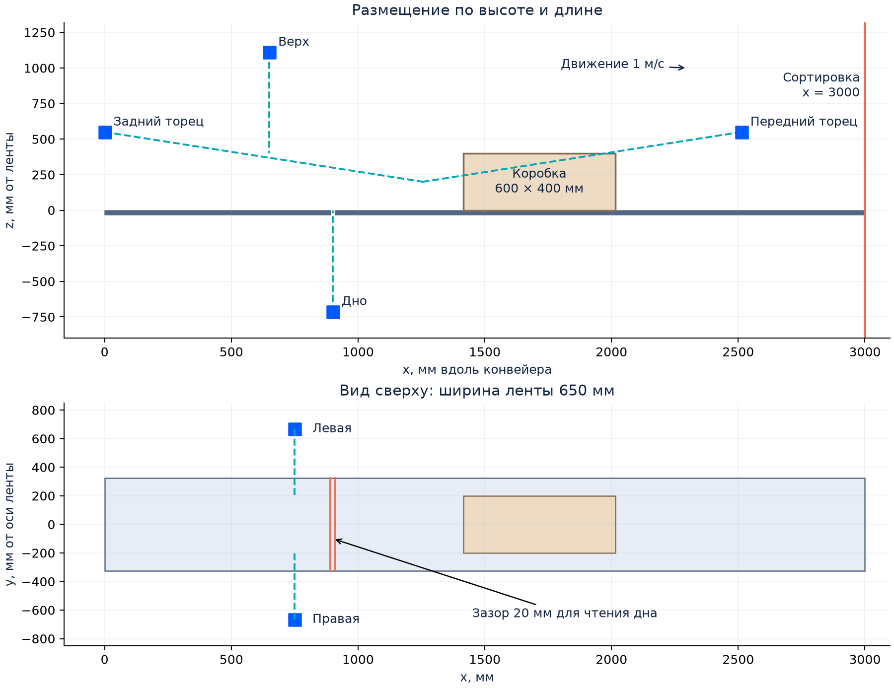
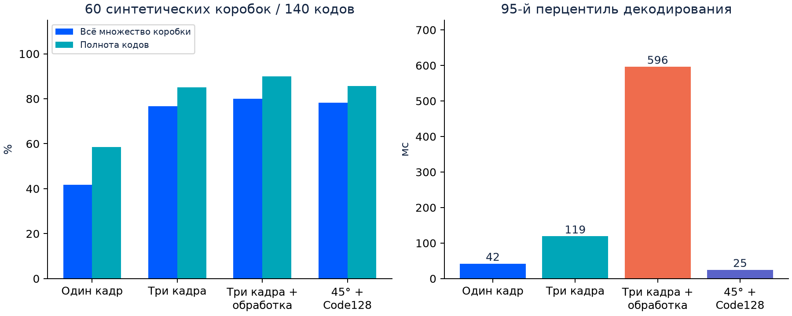

# Шестистороннее чтение штрихкодов на конвейере

Решение варианта 2 тестового задания по Computer Vision для мастерской Ozon. Автор: **Карим Гимадиев**.
**[Открыть PDF-отчёт, 22 страницы](output/pdf/ozon_cv2_report_ru.pdf)** · [Текст отчёта](docs/report.md) · [Jupyter Notebook](notebooks/demo_ru.ipynb) · [Исходные результаты](results/benchmark.json)

Проект объединяет четыре линейные камеры для верха, дна и боковых граней и две площадные камеры для торцов. Энкодер связывает изображения с движением коробки. Локальный компьютер собирает множество прочитанных кодов и передаёт его контроллеру сортировки.



## Что можно проверить

- Конкретные модели камер, объективов, света, датчиков и IPC; размещение и нижний обзор через переход между лентами.
- Расчёты разрешения, смаза, фокуса **целой этикетки**, потоков данных и индивидуального срока доставки.
- Реальное чтение нескольких штрихкодов через ZXing-C++, обработку перекрывающихся полос и объединение кадров.
- Модель контроля коробок и идемпотентного приёмника ПЛК, включая просрочку, пропуски направлений и повторную доставку.
- Эксперимент на 60 синтетических коробках: 180 изображений, 140 эталонных кодов, четыре режима обработки.

Статус работы: **эскизный инженерный проект и работающий программный прототип**. Складская точность и производительность выбранного оборудования требуют стендовой приёмки. Для запуска демонстрации достаточно Python 3.12 и CPU.

## Быстрый запуск

Из корня репозитория, Python 3.12:

```bash
python3 -m venv .venv
source .venv/bin/activate
python -m pip install -r requirements.txt
python -m pytest -q
python -m barcode_reader calculate
python -m barcode_reader decode results/examples/SYN-0000_1.png
```

В Windows окружение активируется командой `.venv\Scripts\activate`.

Результат `decode` - JSON со всеми найденными уникальными значениями, символикой, исходными байтами и координатами четырёхугольника. По умолчанию используется Code128 и дополнительный поворот 45°. Параметр `--formats Code128,DataMatrix,QRCode` задаёт допустимые символики; `--enhanced` добавляет CLAHE и увеличение ×2. CLI запускает декодер в отдельном процессе со сроком 5 с; `--timeout` меняет этот срок, включая загрузку файла и старт процесса. Ключ объединения: **символика + исходные байты**. Несколько наклеек с одинаковым содержимым представлены одним значением.

```bash
python -m barcode_reader benchmark --boxes 60 --seed 20260909
python scripts/inspect_failure.py --box-id SYN-0023
python scripts/demo_control.py
python -m barcode_reader.replay
python scripts/check_native_resolution.py
python scripts/build_report.py
```

Полный эксперимент занимает время, зависящее от компьютера. Для знакомства: `python -m barcode_reader benchmark --boxes 6 --output output/quick`. Отдельная папка сохраняет исходный отчётный прогон. Повтор стандартного запуска обновляет `results/` и задержки; после него команда сборки отчёта обновляет PDF, графики и Markdown.

## Запуск в Google Colab

[Открыть ноутбук в Colab](https://colab.research.google.com/github/gimacorp/ozon-barcode-reader/blob/main/notebooks/demo_ru.ipynb). Выберите обычную среду CPU и выполните ячейки по порядку. Первая ячейка получает репозиторий, следующая проверяет наличие зависимостей и при необходимости устанавливает их. Последующие ячейки показывают чтение, геометрические расчёты, короткий эксперимент и передачу результата имитатору ПЛК.

## Измеренные результаты

Отчётный прогон: Python 3.12.14, macOS arm64, seed `20260909`. Точные задержки и версии сохранены в [benchmark.json](results/benchmark.json).

| Режим | Коробки с полным множеством | Полнота кодов | Ложные значения |
| --- | ---: | ---: | ---: |
| Один кадр | 25/60 (41,7%) | 58,6% | 0 |
| Три кадра | 46/60 (76,7%) | 85,0% | 0 |
| Три кадра + обработка | 48/60 (80,0%) | 90,0% | 1 |
| Три кадра + 45° + Code128 | 47/60 (78,3%) | 85,7% | 0 |



Текущий основной режим - три кадра, исходный вид + 45° и явный Code128. Три исходных режима сохранены для сравнения; их перечень символик выбирает библиотека автоматически. В текущем режиме одновременно изменены обработка угла и перечень символик. Дополнительная обработка увеличила полноту и задержку, а также породила ложное значение у `SYN-0023`. Этот случай сохранён в [журнале предсказаний](results/predictions.jsonl). Выбор промышленной политики подтверждений требует оценки полноты и ошибочной сортировки на реальных данных.

**Область применимости эксперимента:** кадры 1280 × 960, Code 128, синтетические независимые искажения. Геометрическое движение коробки и потоки 65 Мп камер относятся к расчётной части. Декодер получает полный кадр; эталонные строки и координаты доступны генератору и оценке. Производственная контрольная выборка должна фиксироваться отдельно.

Стресс-набор включает 1,25-3,4 пикселя на модуль до дополнительного уменьшения под ячейку изображения; часть условий находится ниже проектного масштаба 3,7-4 пикселя на модуль. Отдельные проверки углов и полного разрешения используют 3,86 пикселя на модуль.

## Основные проектные параметры

| Параметр | Значение |
| --- | --- |
| Лента / скорость / интервал | 650 мм / 1 м/с / 2 с между передними кромками |
| Коробка | 600 × 400 × 400 мм, 600 мм вдоль движения |
| Минимальный модуль X | 0,33 мм, проектное допущение |
| Линейная съёмка | 8192 пикселя, 12 кГц, 40 мкс |
| Торцы | 9344 × 7000, 16 кадров/с, 5 кадров на торец, F/11 |
| Доступно после последнего наблюдения | 985 мс до сортировки; 635 мс после резервов |
| Основные камеры | 4 × Basler raL8192-80km; 2 × Allied Vision hr65MXGE |

Все параметры находятся в [configs/conveyor.json](configs/conveyor.json). Команда `calculate` пересчитывает геометрию, фокус, дискретизацию, смаз и бюджеты. Модель целой этикетки проверяет 972 позиции/поворота в 21 фазе запуска; дифракция и фактическая MTF выделены в программу оптических испытаний.

## Граница реализации

| Выполнено в репозитории | Интеграционный этап |
| --- | --- |
| Декодирование изображений настоящей библиотекой | Драйверы шести камер и аппаратные триггеры |
| Перекрывающиеся полосы и объединение значений | Потоковая сборка строк из плат захвата |
| Геометрическая модель и проверка фокуса | Калибровка, механические допуски, оптический стенд |
| Модель box_id и сроков с тестами | Назначение ROI реальным движущимся коробкам |
| Имитатор идемпотентного ПЛК в памяти | Постоянный журнал, сеть и драйвер ПЛК |
| Синтетический эксперимент | Реальная выборка и приёмочная серия |

Статус `read` означает наличие чтений при завершённом наблюдении всех направлений. Поле `complete_set_verified: false` явно сохраняет неопределённость физического числа этикеток. Контроллер применяет правила маршрутизации ко всем значениям, а исключения обрабатываются отдельным маршрутом.

## Структура

```text
barcode_reader/       Декодер, генератор, эксперимент, геометрия и модель ПЛК
configs/              Параметры инженерного расчёта
tests/                77 автоматических проверок
notebooks/            Демонстрация на русском языке
scripts/              Сборка отчёта и воспроизведение ошибки / обмена с ПЛК
results/              CSV, JSON, предсказания каждой коробки и примеры кадров
docs/                 Текст отчёта и схемы
output/pdf/           Итоговый PDF
```

Подробная [повторная проверка соответствия](docs/audit.md) описывает найденные ошибки и исправления. Текущая версия проходит 77 проверок, включая 36 углов. Сквозной сценарий восстановил по 12 кодов у двух коробок с шестью гранями; проверено чтение единичных кадров проектного разрешения. Первоисточники приведены в отчёте. Приоритет следующего практического этапа: проверить минимальный код на торцах при F/11 и 40 мкс, затем подтвердить механику нижнего обзора.
