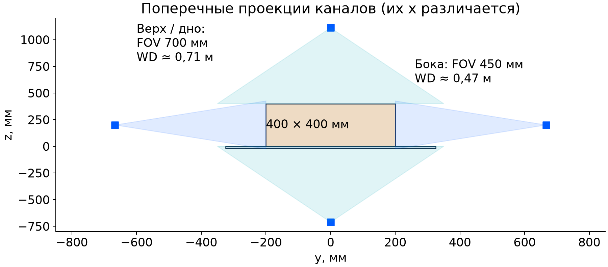
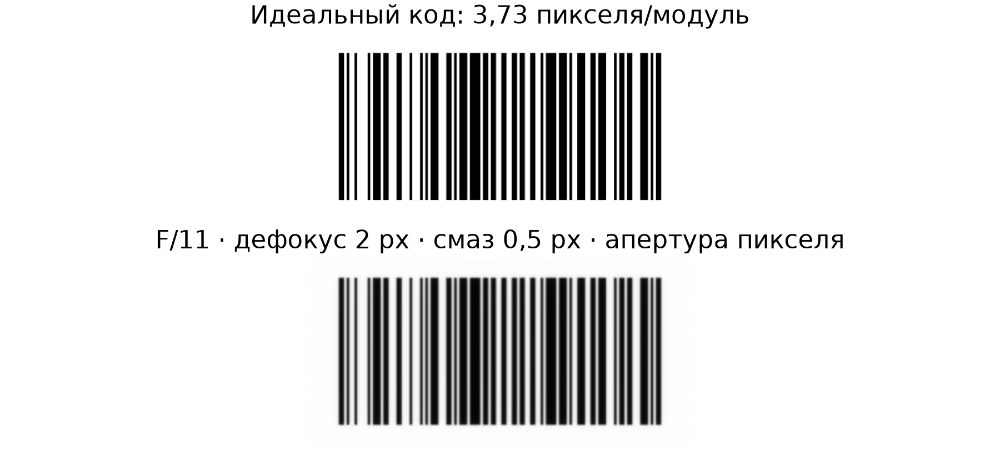
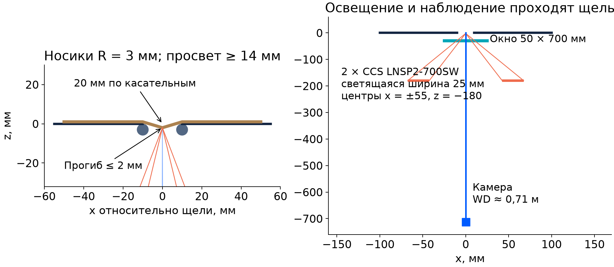
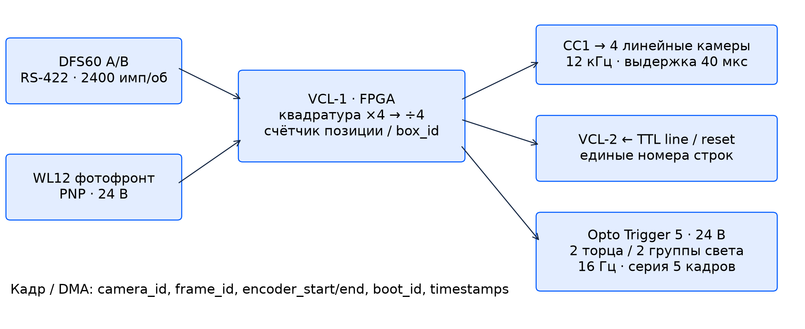
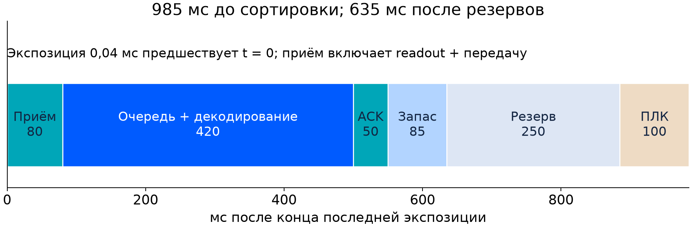
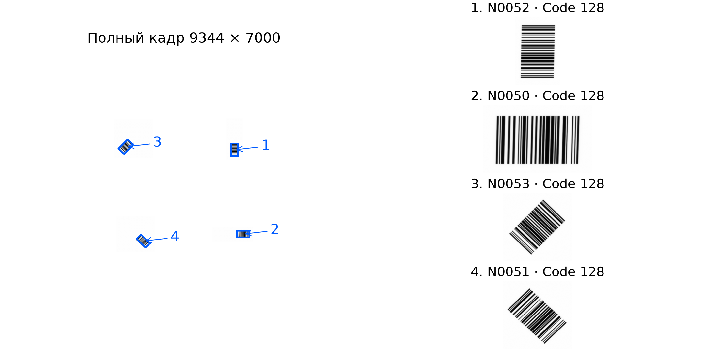
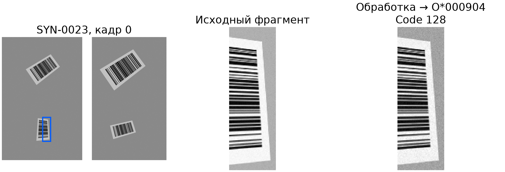
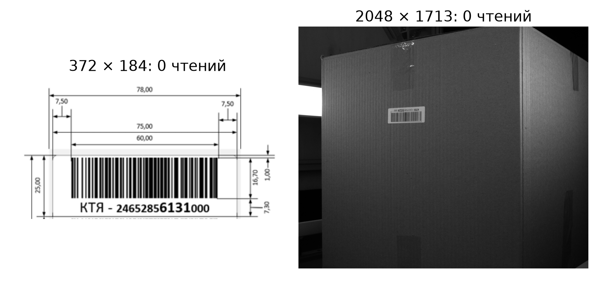

# Шестистороннее чтение штрихкодов

Карим Гимадиев · CV, вариант 2 · 10 сентября 2026


## Шестистороннее чтение штрихкодов

**Программно-аппаратный комплекс для сортировочного конвейера**

Карим Гимадиев · Мастерская Ozon
Computer Vision · Вариант 2 · 10 сентября 2026

### Предложение

Четыре линейные камеры сканируют верх, дно и бока. Две площадные камеры читают торцы сериями из пяти кадров. Энкодер связывает захват с перемещением коробки; локальный компьютер объединяет значения и передаёт их системе управления складскими потоками — WCS.

| Задача | Результат проектирования |
| --- | --- |
| 650 мм · 1 м/с · интервал 2 с | 1800 коробок/ч; шесть направлений съёмки |
| Коробка 600 × 400 × 400 мм | X ≥ 0,33 мм; до 24 значений на коробку |
| Сортировка через 3 м | 635 мс на получение, обработку и доставку после резервов |
| Доступные данные | Две иллюстрации условия, стресс-синтетика и физическая модель изображений |


### Экспериментальное подтверждение

Номинальная модель: **10/12 коробок, 288/288 значений**. CPU replay: 36 коробок, 1368 заданий, 8 процессов; p99 477,8 мс, просрочек 0/36.

Статус: инженерное предложение и воспроизводимый программный прототип. Оптика, механика, SDK камер и промышленная сеть подлежат стендовой приёмке. Физический стенд и собственная фотосерия в работу не входят. Код и результаты: [20].


## Содержание

Основная часть — 15 страниц, с 3-й по 17-ю. Ведомость и источники вынесены в приложения.

Синие названия в содержании кликабельны. PDF содержит закладки разделов. Подробные интерфейсы и электрические соединения: docs/system_contract.md; воспроизведение: docs/validation.md.


## 01 / Контракт и выбор схемы

Исходные требования [1]: произвольная грань и ориентация этикетки, несколько кодов, передача всех прочитанных значений для сортировки. В проекте 600 мм направлены вдоль движения. Интервал 2 с измеряется между передними кромками; свободное расстояние между коробками — 1400 мм.

| Проектное допущение | Значение и причина |
| --- | --- |
| Минимальный модуль X | 0,33 мм; условие его не задаёт. Линейный масштаб 3,86–6,01 пикселя/модуль; торцевой минимум модели 3,73. |
| Этикетки / значения | До 78 × 25 мм; до четырёх этикеток на грань и 24 уникальных значений на коробку. До 128 байт/значение; геометрическая длина символа ограничена X и размером этикетки. |
| Подача | Центр ±3 мм, yaw/pitch/roll ±0,5°, ширина ±4 мм, высота ±5 мм; деформация ограничена далее. |
| Ключ результата | Символика + исходные байты; одинаковые физические наклейки представлены одним значением. |


### Альтернативы

| Схема | Каналы / оптика / нагрузка / сложность |
| --- | --- |
| Гибридная — выбор | 6 камер; узкое сечение четырёх граней; 2,49 ГБ/с пик, 445 МБ/с среднее; два интерфейса и FPGA. |
| Полностью площадная | 6+ камер; все грани требуют широкого поля и фокуса. При 6 × 65 Мп × 16 Гц: 6,28 ГБ/с. Дно требует прозрачного участка или перекладки. |
| Готовый тоннель | Количество каналов выбирает поставщик; закрытая обработка, меньшая собственная интеграция; приёмка того же X, дна и сроков. |


Ориентиры планирования, допущения автора: гибрид 40–90 тыс. евро; площадная схема 60–120 тыс.; готовый тоннель 60–150 тыс. Диапазоны включают механику/интеграцию, имеют неопределённость порядка ±50% и требуют коммерческих предложений. Основа сравнения — число каналов и объём данных.


## 02 / Размещение и поля зрения


Ось x идёт вдоль ленты, y поперёк, z вверх от её поверхности. Торцевые камеры: (0; 0; 550) и (2513; 0; 550) мм; оптические оси направлены в (1256; 0; 200). Наклон 15,6° позволяет видеть торец над соседней коробкой. Номинальная дистанция — около 1,30 м.

| Канал | Сечение и положение камеры |
| --- | --- |
| Верх | x=650; z≈1112 мм; поле 700 мм |
| Левый / правый | x=750; y≈±667; z=200 мм; поле по высоте 450 мм |
| Дно | x=900; z≈−712 мм; поле 700 мм через щель |


Графика показывает условные символы линейных камер по высоте; точные расчётные координаты приведены в таблице. Свет торцов размещается вокруг объективов четырьмя линейками на канал, с направлением на его собственную зону съёмки. Направляющие заканчиваются до открытых сечений.


## 03 / Линейная оптика и допуски



Basler raL8192-80km: 8192 пикселя по 3,5 мкм [2,21]. Объектив 28 мм, F/8. Модель тонкой линзы: s=f(1+FOV/S). Геометрический кружок нерезкости — 2 пикселя; H=f²/(Nc)+f, границы Hs/(H±(s−f)).

| Канал | WD / фокус, мм | Бюджет глубины / ближний запас |
| --- | --- | --- |
| Верх | 712 / 679–748 | 12,36 / 33,07 мм |
| Дно | 712 / 679–748 | 4,00 / 33,07 мм |
| Левый | 467 / 453–483 | 11,36 / 14,20 мм |
| Правый | 467 / 453–483 | 11,36 / 14,20 мм |


Боковой бюджет: 3 мм смещения + 2 мм половины допуска ширины + 300·sin(0,5°)=2,62 мм yaw + 200·sin(0,5°)=1,75 мм roll + 1 мм выпуклости + 1 мм настройки фокуса. Остаток — 2,84 мм. Верх: высота 5 + pitch 2,62 + roll 1,75 + изгиб 2 + настройка 1 = 12,36 мм.

Дно: прогиб 2 + ход ленты 1 + настройка 1 = 4 мм. Направляющие обеспечивают центр и угол; приёмка — калибр и замер крайних положений. Непрерывное измерение деформации потребует датчика профиля. Расстояния округлены: паспорт LD указывает эффективное f=28,65 мм [22].


## 04 / Торцы: контраст и фокус

hr65MXGE: 9344 × 7000, глобальный затвор, 3,2 мкм, до 17,4 Гц [3]. Выбор 65 Мп обеспечивает минимум 3,73 пикселя/модуль при X=0,33 мм на сетке торца. Объектив 50 мм, F/11, 40 мкс; геометрическая глубина резкости 92,1 мм. Пять кадров с шагом 62,5 мм покрывают все 972 положения/поворота целой этикетки в 21 фазе модели.

### Передача контраста

Частота узких чередующихся полос ν=1/(2·3,73·0,0032)=41,9 пар линий/мм. Некогерентная дифракционная MTF: 2/π·[acos(q)−q√(1−q²)], q=λNν, λ=550 нм. Дефокус моделируется диском; движение и пиксель — прямоугольными апертурами. MTF — функция передачи модуляции.

| Дифракция | Дефокус 2 px | Смаз 0,5 px | Пиксель | Аберрации* | Итого |
| --- | --- | --- | --- | --- | --- |
| 0,681 | 0,914 | 0,993 | 0,971 | 0,957 | 0,574 |




*Аберрации — предположение Gaussian σ=0,35 px. Диск Эйри 4,61 px; расчёт MTF совместно учитывает размытия [23]. Это оценка стационарной модели участка; реальная MTF выбранного объектива при рабочей дистанции, спектр света и шум требуют измерения. Два пригодных кадра целой этикетки покрывают только 13,9% положений в худшей фазе; K=2 исключён из обязательной базовой политики.


## 05 / Нижний обзор



Дно сканируется строкой при прохождении между двумя лентами [19]. Верхние касательные носиков R=3 мм расположены в x=±10 мм относительно оптической линии; минимальный чистый просвет между носиками — 14 мм. Прогиб картона ограничен 2 мм. Окно 700 × 50 × 2 мм находится на 30 мм ниже ленты; сдвиг фокуса плоскопараллельным стеклом компенсируется настройкой.

Два CCS LNSP2-700SW расположены по обе стороны наблюдения: x=±55, z=−180 мм, длинной стороной вдоль y. Каждый источник имеет ширину свечения 25 мм [8]. Лучи от его крайних точек проходят щель; минимальный расчётный зазор луча до ролика — 5,31 мм при прогибе 0–2 мм. Корпуса света освобождают центральный канал камеры.

Передняя и задняя кромки пересекают ту же строку наблюдения; скан продолжается до конца измеренного диапазона, включая последнюю короткую полосу. Перекрытие 85,33 мм превышает диагональ этикетки 81,91 мм. Отдельный тест читает код в первой и последней полосах.

Проверка относится к идеальным лучам продольного сечения. Приёмка: этикетки вплотную к обеим кромкам, устойчивость перехода, деформация, свет по всей ширине, блики окна, загрязнение и очистка. Механическая прочность картона определяется натурным испытанием.


## 06 / Синхронизация и захват



DFS60 [6]: 2400 периодов на оборот колеса 200 мм. Квадратура ×4 даёт 9600 отсчётов, деление на 4 — 12 строк/мм и 12 кГц при 1 м/с. Фотофронт WL12 [5] фиксирует box_id и начальный счётчик. Целевая ошибка позиции ±1 мм включает разрешение, задержку датчика до 0,33 мм, проскальзывание и калибровку.

A/B RS-422 подключаются к дифференциальным GPI VCL-1 при 5 В. PNP 24 В — к отдельному порту Opto-Coupled Trigger 5 с pull-down. Master передаёт TTL line/reset второй плате. Плата расширения формирует 24-В триггеры торцов и света; силовое питание света вынесено в контроллеры [25,30].

Линейный режим: Mono8, Camera Link Base 1X2, 65 МГц — теоретически 130 Мпикс/с против необходимых 98,304. Полезная строка передаётся за 63,0 мкс при периоде 83,3 мкс; выдержка 40 мкс. Приёмка подтверждает resulting line rate и отсутствие overtrigger [21].

FPGA добавляет camera/frame ID, encoder start/end, epoch и отметки времени к DMA. Свет торцов включается заранее (начально 20 мкс) и охватывает экспозицию; задержки калибруются осциллографом. Кабели и питание — приложение А. Прошивка VisualApplets и драйверы камер являются интеграционным этапом; точный контракт дан в docs/system_contract.md.


## 07 / Потоки и срок результата

| Параметр | Расчёт |
| --- | --- |
| Четыре линейные камеры | 4 × 8192 × 12000 = 393,216 МБ/с |
| Два торцевых потока | 2 × 9344 × 7000 × 16 = 2093,056 МБ/с |
| Пик / на коробку / среднее | 2,486 ГБ/с / 890,01 МБ / 445,00 МБ/с |
| Последнее наблюдение заднего торца | x≈1415 мм; передняя кромка x≈2015 мм |
| До сортировки / после резервов | 985 мс / 635 мс; ПЛК 100 мс, резерв 250 мс |




Экспозиция заканчивается в t=0; затем считывание и передача формируют готовое изображение. Один торцевой кадр — 65,408 МБ: минимум 52,33 мс на проводе 10 Гбит/с. Проект выделяет 80 мс с учётом служебных расходов и частичного перекрытия операций; фактический readout проверяется SDK.

Бюджет 500 мс считается от конца экспозиции и включает 80 мс получения и 420 мс очереди/декодирования. Доставка и ACK получают 50 мс. Остаётся 85 мс дополнительного запаса. Крайний срок каждой коробки связан с её длиной и энкодерной позицией.

Локальный промышленный компьютер (IPC) выбран из-за сроков и объёма данных. Облако получает журналы и выборочные ошибки асинхронно. При постоянной записи 445 МБ/с накопителя 2 ТБ хватит примерно на 75 минут; основная запись — кольцевой буфер и события.


## 08 / Нагрузочный replay

Машина: Apple M5. Выполнено 3 отдельных запусков пула, 8 процессов. До 24 значений на коробку, четыре постоянные этикетки на грань. Углы 0/45/90/135°, слабый контраст, размытие и пустые изображения; координаты этикеток согласованы между полосами.

| Измерение | Результат |
| --- | --- |
| 36 коробок / 1368 заданий | Встречаются пропуски/ошибки отдельных изображений |
| p95 / p99 от последней экспозиции | 475,2 / 477,8 мс, включая ACK |
| Просрочки / полные множества | 0/36; 24/36 |
| Очередь / всего в работе | 5 / 13 заданий |
| Обслуживание p95 | Торец 407,7 мс; полоса 160,3 мс |


Отдельные прогоны, p95 / p99: 469,3 / 475,5 мс; 472,3 / 477,1 мс; 471,4 / 473,9 мс. Все коробки уложились в срок этой серии.

### Диспетчер и расчёт запаса

Общий EDF-пул шести каналов: до 64 ожидающих заданий. Переполнение и исчерпание срока отменяют остаток коробки. Модель длинной серии использует измеренный p95 полного обслуживания, включая создание массива.

| Процессы / множитель p95 | Просрочки | Очередь / p95 успешных |
| --- | --- | --- |
| 1 / ×1,0 | 100,0% | 30 / — |
| 4 / ×1,0 | 100,0% | 16 / — |
| 8 / ×1,0 | 0,0% | 5 / 537,7 мс |
| 8 / ×1,5 | 100,0% | 11 / — |


Каждый CPU-вызов получает новый синтетический массив внутри процесса; время подготовки включено в замер. IPC/DMA и SDK требуют отдельной приёмки. p99 малой серии описательный. i7-13700 / 64 ГБ — кандидат для стенда: 3,56 ГБ кольцу четырёх коробок, до 16 ГБ процессам, по 8 ГБ ОС/SDK и служебным буферам; остальное — запас.


## 09 / Алгоритм и полнота захвата

Последовательность: фотофронт → аппаратный ID и положение → захват кадров/строк → контроль потерь → декодирование → геометрическое назначение → объединение значений → фиксация контракта → доставка WCS.

| Этап | Реализованное правило |
| --- | --- |
| Символики / обработка | ZXing-C++ 3.1.1, Code 128, исходный кадр и +45°. Координаты возвращаются обратным преобразованием. CLAHE/×2 — дополнительный режим. |
| Линейные полосы | 2048 строк, перекрытие 1024; сохраняются camera/scan ID и исходный диапазон. Formats передаётся во все пути; Data Matrix проверен отдельным чтением. |
| Назначение ROI | Четыре угла обнаружения переводятся калибровочной матрицей в грань. Единственное строгое вхождение назначает коробку; пересечение/неоднозначность исключается. |
| Полнота захвата | Сессия, коробка, ожидаемая камера и scan/frame ID; все запланированные фрагменты и непрерывный диапазон строк. Чужие источники отвергаются. |
| Результат | Ключ (формат, байты), observed_faces, capture_complete, статусы read / no_read / unconfirmed / incomplete_views / late / ambiguous_assignment. |


### Происхождение подтверждений

Повторная обработка одного кадра считается одним источником. Перекрывающиеся полосы используют общие исходные строки; число непересекающихся интервалов считается отдельно. Для обеих схем базовое K=1 допускает чтение в единственном пригодном изображении. Контрольная сумма, перечень форматов и прикладная валидация снижают риск ошибки; остаточный риск измеряется на приёмке.

Один кадр может содержать несколько ROI разных коробок. Декодер сохраняет отдельные пространственные экземпляры одинакового значения. Реестр ROI назначает владельца; значения объединяются внутри коробки. Сквозной replay проверяет общий кадр двух коробок, пропуск полосы, старую сессию и повтор доставки. Закрытые треки и их ROI удаляются через 5 с после срока.

capture_complete проверяет захват поверхности. complete_set_verified=false сохраняет неизвестность физического числа наклеек. Метрики относятся к уникальным значениям; число физических наклеек требует отдельной разметки. OpenCV используется для геометрии и преобразований, python-barcode — независимый генератор [15–18].


## 10 / Номинальный эксперимент

12 коробок, 288 постоянных значений на шести гранях. У каждой этикетки фиксированы содержимое и ориентация; движение меняет проекцию. Размеры растров, масштаб, скорость, сетка кадров и полосы берутся из общего конфига. Углы распределены с шагом 15°; фазы охватывают полный шаг серии.



**10/12 полных множеств, 288/288 истинных значений, 2 ложных.** Wilson 95% по коробкам: 55,2–95,3%.

Постоянные этикетки, до 4 на каждой из 6 граней. Размеры растров, сетка кадров, масштаб, скорость, выдержка и полосы взяты из сохранённого конфига. Проекция тонкой линзы, дефокус по худшему углу этикетки, дифракция, апертура пикселя и условная аберрация sigma=0.35 px. Плоские матовые этикетки, постоянное освещение, без шума фотонов, бликов, окклюзий и калибровочных ошибок. Проекции торцов симметричны. Скорость/позиции заданы моделью; это проверка согласованности проекта. Manifest содержит физические координаты и проекции всех кадров; декодер получает полный массив.


## 11 / Факторное сравнение

Стресс-набор: 60 коробок, 180 изображений 1280 × 960, 140 значений. Кадры независимо меняют масштаб и ориентацию этикеток; набор исследует пределы объединения. Во всех конфигурациях одинаковые изображения, seed 20260909.

| Режим трёх кадров | Полный набор | TP / FP | p95, мс |
| --- | --- | --- | --- |
| Авто / 0° | 46/60 | 119/140; 0 | 120,8 |
| Авто / +45° | 47/60 | 120/140; 0 | 232,1 |
| Code 128 / 0° | 46/60 | 119/140; 0 | 7,2 |
| Code 128 / +45° | 47/60 | 120/140; 0 | 25,1 |
| Code 128 / +45° + CLAHE | 48/60 | 125/140; 1 | 63,4 |
| Code 128 / +45° + ×2 | 49/60 | 126/140; 0 | 106,3 |


Явный Code 128: добавление +45° меняет число полных наборов с 46 до 47, TP с 119 до 120, p95 с 7,2 до 25,1 мс. Базовый режим включает диагональный поиск; статистическая устойчивость разницы проверяется на независимых данных.

CLAHE отдельно: 125 TP, 1 FP, p95 63,4 мс. Увеличение ×2 отдельно: 126 TP, 0 FP, 49 полных наборов, p95 106,3 мс. Включение дополнительной обработки в основной поток требует повторной проверки сроков.

Журнал ablation_predictions.jsonl хранит формат и исходные байты по каждому кадру. Числа и выводы этой страницы формируются из одного ablation.json. CPU и версии среды сохранены в metadata; длительность относится к конкретной машине и корпусу.


## 12 / Сложность и ошибки


| Группа | Полное множество | Wilson 95% | Полнота значений |
| --- | --- | --- | --- |
| Чистые | 20/20 — 100% | 83,9–100,0% | 46/46 — 100,0% |
| Умеренные | 17/20 — 85% | 64,0–94,8% | 42/46 — 91,3% |
| Сложные | 10/20 — 50% | 29,9–70,1% | 32/48 — 66,7% |


По значениям Wilson 95%: чистые 92,3–100,0%; умеренные 79,7–96,6%; сложные 52,5–78,3%. Коды одной коробки зависимы; эти интервалы описательные. Основная статистическая единица — коробка.

### Цена фильтрации на всём наборе

Усиленный режим: 126 TP / 1 FP. Два кадра: 90 TP / 0 FP; потеря 36 правильных значений. Маска OZ + 6 цифр: 126 TP / 0 FP. Маска применяется при согласованном формате данных WCS.

Code 128 +45°: K=1 — 120 TP / 0 FP; K=2 — 87 TP / 0 FP. Полные таблицы политик и интервалы сохранены в results/ablation.json.


## 13 / Изображения и реальные данные



Исходный кадр и обработанный фрагмент показывают конкретную ошибку. Ограничение Code 128 сохраняет возможность этого класса ошибки: он возник и при отдельном CLAHE-проходе. Контрольная сумма сама по себе не гарантирует правильность результата.



Исходники 372 × 184 и 2048 × 1713 взяты из задания [1]. На чертеже 60 мм штрихов занимают примерно 188 px: около 3,1 px/мм и 1,03 px на проектный X=0,33 мм. Точный X исходной маркировки неизвестен; перспектива и сжатие также ограничивают читаемость. Собственная фотосерия требует физической съёмки; протокол и печатный оригинал подготовлены в docs/photo_protocol.md.


## 14 / Масштабирование и приёмка

| Скорость | Бюджет | Этикетка в фокусе | Частота прежнего шага |
| --- | --- | --- | --- |
| 1,0 м/с | 635 мс | 100,0% | 16 Гц |
| 1,5 м/с | 253 мс | 69,4% | 24 Гц |
| 2,0 м/с | 65 мс | 51,9% | 32 Гц |


Покрытие — худшая фаза дискретной геометрии, отдельно от вероятности чтения. Паспорт торцевой камеры ограничен 17,4 Гц [3]; удвоенная скорость требует замены камеры, нескольких фокальных зон или переноса наблюдения раньше. Дальнейшее уменьшение выдержки компенсируется светом; линейную частоту повышают до 24 кГц.

| Изменение | Численный предел и действие |
| --- | --- |
| X=0,20 мм | 2,34 px/модуль на линейном канале, 2,26 на торце. Для цели 3 px сократить горизонтальное поле до ≤546 мм и торцевое примерно до ≤565 мм либо повысить разрешение. |
| 800 × 500 × 500 мм | Остаток 435 мс; боковая высота выходит за поле на 50 мм. Пересмотреть FOV, дистанцию/фокус, длину скана и временной бюджет. |
| Другие символики | Formats проходит через decode и decode_strips. Data Matrix с бинарными байтами проверен. Для каждого формата заново квалифицировать X, декодер и нагрузку. |


### План квалификации

Пилот: калибровка геометрии/энкодера → худшие допуски подачи → F/11 и минимальный X на всех углах → кромки дна/прогиб → 24 кода на коробке → потеря строк/кадров → перегрузка и отказ сети → длительный прогон. Цели: полный набор значений, нулевая ошибочная маршрутизация в серии, p99 получение+обработка ≤500 мс, ACK ≤50 мс.

Для односторонней границы вероятности отказа ≤0,1% с доверием 95% при нуле отказов нужно 2995 независимых коробок: ceil[ln(0,05)/ln(0,999)]. Повторные кадры и повторные прогоны одной коробки независимыми объектами не считаются.

Нейросетевая локализация — дальнейшее развитие при новых дефектах. Для неё потребуется реальная размеченная выборка с отдельными площадками/днями в train/validation/test, затем сравнение с текущим специализированным декодером. Нейросеть в базовой архитектуре отсутствует.


## 15 / Обмен, версия и запуск

Получатель — WCS; базовый транспорт HTTP/1.1 keep-alive, POST /v1/barcode-events, JSON до 16 КиБ. До 24 значений по 128 байт. Timeout ACK 20 мс, повтор каждые 20 мс до срока, общий резерв 50 мс. SQLite Outbox/WCS сохраняют message_id и неизменное тело после перезапуска.

```
{"schema_version":2, "message_id":"boot42:B001:1", "box_id":"B001",
 "deadline_s":2.65, "status":"read",
 "capture_complete":true, "complete_set_verified":false,
 "codes":[{"format":"Code 128", "text":"OZ000001",
           "payload_hex":"4f5a303030303031"}]}
```

```
{"message_id":"boot42:B001:1", "receipt":"accepted",
 "sorting":"pending"}
```

ACK означает долговечное принятие; событие исполнения сортировки приходит отдельно от ПЛК. Поздние пакеты дают исключение. Сессия уникальна для запуска reader. Общая эпоха монотонных часов сохраняется при рестарте процесса; смена эпохи ОС переводит старые записи в карантин. Выше — сокращённые фрагменты; полный валидный пакет: results/message_example.json. Журнал хранит терминальные записи сутки, затем prune освобождает их.

### Версия и короткая проверка

Артефакты: **submission-v3** [20]. Измерительный CPU: Apple M5. Ревизия исходников нагрузки: ae49c5ca7bc5. Полные SHA, изменения рабочей копии, ОС, Python, пакеты и конфиг автоматически записаны в metadata результатов; хеши входов PDF — report_manifest.json.

```
git checkout submission-v3
python -m pip install -r requirements.txt
python -m pytest -q
python -m barcode_reader calculate
python -m barcode_reader.replay
```

Ожидается: все тесты пройдены, calculations.json обновлён, сквозная демонстрация 2/2 коробки. Длительность актуального запуска и группы тестов сохраняются в verification.json.

Группы проверок: декодирование/углы/полосы; оптика и геометрия; время и очередь; назначение и полнота захвата; долговечная доставка. 36 случаев — параметризация углов 0–175° с шагом 5°. Полное воспроизведение, Jupyter Notebook и ожидаемые результаты приведены в README; количества проверок фиксирует results/verification.json.


## Приложение А / Комплектующие 1

| Кол. | Компонент / артикул | Назначение |
| --- | --- | --- |
| 4 | Basler raL8192-80km | 8192 × 1; 3,5 мкм; 12 кГц, Mono8; внешний 24 В [2,21] |
| 2 | Allied Vision hr65MXGE / F004121 | 9344 × 7000; 3,2 мкм; global shutter; 16 Гц; 10GigE [3] |
| 2 | EMERALD 2.8/28 V48-LD / 1071610 | Верх и дно: около 0,71 м, F/8 [4,22] |
| 2 | EMERALD 2.8/28 V48-SD / 1071611 | Бока: около 0,47 м, F/8 [29] |
| 2 | EMERALD 2.2/50 V48 / 1070074 | Торцы: около 1,30 м, F/11; круг 43,2 мм [29] |
| 4+4 | Basler 2000033271 + Schneider 1072660 | Фланец racer M42×1 FBD16 + V48/M42×1 [4,24] |
| 2 | Schneider 1072659 | V48/M58×0,75 для торцевых камер [4] |
| 5 | CCS LNSP2-700SW | Верх, два бока, две стороны щели дна; 700 × 25 мм; 140 Вт [8] |
| 3 | CCS PSB4-60024-2-PEI | Шесть каналов по 300 Вт; пять занято по 140 Вт [28] |
| 8 | SVL L300G2-WHI | По четыре на торец; начальная оптика 30°; 24 В, до 6 А импульс [9] |
| 2 | MEAN WELL RSP-750-24 | 24 В / 31,3 А; на группу из четырёх SVL до 24 А [26] |
| 1+1 | MEAN WELL HDR-150-24 + HDR-15-5 | 24 В / 6,25 А камеры и датчик; 5 В / 2,4 А энкодер/GPIO [27] |
| 1 | SICK WL12-3P1151 / 1041449 + PL80A | PNP, фотофронт; отражатель напротив датчика [5] |


Спецификация эскизного проекта. Кабельные сборки заказываются по указанным разъёмам, току и длине; точные vendor SKU зависят от исполнения. Проверить фланцевые отрезки и ход фокусировки. Четыре 8k-камеры питаются внешними 24 В: их 5,5 Вт превышают 4 Вт PoCL на порт выбранной VCL. Пять CCS дают 700 Вт установленной световой нагрузки; три контроллера обеспечивают отдельный канал каждому источнику.


## Приложение А / Комплектующие 2

| Кол. | Компонент / артикул | Назначение |
| --- | --- | --- |
| 1 | SICK DFS60A-S4PC65536 / 1036726 | RS-422 A/B; программирование 2400 периодов/оборот; колесо 200 мм [6] |
| 2 | microEnable 5 marathon VCL / 2200000359 | По две Base камеры; PCIe Gen2 ×4; master/slave FPGA [30] |
| 1 | Basler Opto-Coupled Trigger 5 / 2200000371 | Плата 8 входов / 8 выходов; изолированные порты 5/24 В; шлейф в комплекте [25] |
| 1 | IPC-7130 + AIMB-788, i7-13700 | 64 ГБ DDR4; NVMe 2 ТБ; 3 слота PCIe ×4; приёмка по replay [10,11] |
| 1 | Intel X550-T2 | Два прямых порта 10GbE; PCIe 3.0 ×4 [12] |
| 4 | Camera Link Base SDR26–SDR26, 3 м | Экранированные кабели с винтами; 65 МГц/1X2 [21] |
| 4+2 | Кабельные сборки питания камер, 3 м | 4 × Hirose 6-pin racer; 2 × HR10A-10P-12S hr65; отдельные предохранители [3,21] |
| 2 | Cat6A S/FTP RJ45, 3 м | Два независимых линка камер; сервисный Ethernet отдельно [3,12] |
| 5+8 | Кабели CCS / SVL по исполнению разъёмов | 5 силовых CCS ≥140 Вт; 8 силовых/trigger SVL ≥6 А; длина до 3 м [8,9] |
| 1 | Сборка синхронизации D-Sub15 / клеммы | RS-422 экранированные пары; master TTL line/reset; opto 24 В к торцам [25,30] |
| 1 | Переход лент с ножевыми носиками R3 | 20 мм между верхними касательными; окно 700 × 50 × 2 мм; очистка [19] |
| 1 | Рама, направляющие, закрытый кожух, шкаф | Выравнивание до камер; сервис дна; вентиляция по тепловой нагрузке [Проект] |


Спецификация эскизного проекта. Кабельные сборки заказываются по указанным разъёмам, току и длине; точные vendor SKU зависят от исполнения. Проверить фланцевые отрезки и ход фокусировки. Четыре 8k-камеры питаются внешними 24 В: их 5,5 Вт превышают 4 Вт PoCL на порт выбранной VCL. Пять CCS дают 700 Вт установленной световой нагрузки; три контроллера обеспечивают отдельный канал каждому источнику.


## Приложение Б / Источники 1

Первичные источники; обращение 9–10 сентября 2026. Расчётные модели, диапазоны стоимости и интерпретация экспериментов принадлежат автору.

**[1]** [Условие: мастерская Ozon, CV, вариант 2](https://docs.google.com/document/d/1mkqW0bW2fNh_6hSne3xasKlrhmOOrRw6mmtbPp4pUrU/edit?tab=t.croqf6r91zx2)

**[2]** [Basler: raL8192-80km](https://www.baslerweb.com/en-us/shop/ral8192-80km/)

**[3]** [Allied Vision: hr65MXGE, F004121](https://www.alliedvision.com/en/products/area-scan-cameras/hr/hr-10gige/view/2005)

**[4]** [Schneider-Kreuznach: объективы EMERALD и адаптеры V48](https://schneiderkreuznach.com/en/industrial-optics/lenses/large-format-lenses/emerald)

**[5]** [SICK: WL12-3P1151, 1041449](https://cdn.sick.com/media/pdf/0/20/320/dataSheet_WL12-3P1151_1041449_en.pdf)

**[6]** [SICK: DFS60A-S4PC65536, 1036726](https://www.sick.com/media/pdf/8/58/958/dataSheet_DFS60A-S4PC65536_1036726_en.pdf)

**[7]** [Basler: microEnable 5 marathon](https://docs.baslerweb.com/frame-grabbers/microenable-5-marathon)

**[8]** [CCS: линейный свет LNSP2-700SW](https://www.ccs-grp.com/products/model/1888)

**[9]** [Smart Vision Lights: L300G2](https://smartvisionlights.com/products/l300g2-linear-light/)

**[10]** [Advantech: паспорт AIMB-788, редакция 2025](https://advdownload.advantech.com/productfile/PIS/AIMB-788/file/AIMB-788_DS%28082125%2920250829163609.pdf)

**[11]** [Advantech: конфигурации на AIMB-788](https://buy.advantech.com/Configure-System/bymodel-AIMB-788.htm)

**[12]** [Intel: X550-T2, спецификация](https://www.intel.com/content/www/us/en/products/sku/88209/intel-ethernet-converged-network-adapter-x550t2/specifications.html)

**[13]** [Basler: настройка качества изображения](https://docs.baslerweb.com/optimizing-image-quality)

**[14]** [GS1: выбор штрихкода, X-размер и свободные зоны](https://www.gs1.org/standards/barcodes/10-steps-to-barcode-your-product/english)

**[15]** [ZXing-C++: исходный код и поддерживаемые форматы](https://github.com/zxing-cpp/zxing-cpp)


## Приложение Б / Источники 2

Первичные источники; обращение 9–10 сентября 2026. Расчётные модели, диапазоны стоимости и интерпретация экспериментов принадлежат автору.

**[16]** [ZXing-C++: интерфейс Python, тег v3.1.1](https://github.com/zxing-cpp/zxing-cpp/blob/v3.1.1/wrappers/python/zxing.cpp)

**[17]** [OpenCV: геометрическая калибровка](https://docs.opencv.org/4.x/d9/d0c/group__calib3d.html)

**[18]** [python-barcode: документация генератора](https://python-barcode.readthedocs.io/en/stable/)

**[19]** [Cognex: пример промышленного чтения нижней грани](https://www.cognex.com/library/media/press-release-media/press-release-pdfs/cognex-bottom-side-barcode-reading-system.pdf)

**[20]** [Репозиторий решения: код, тесты, исходные результаты](https://github.com/gimacorp/ozon-barcode-reader)

**[21]** [Basler racer Camera Link: AW001185, v08, 29.04.2019](https://assets-ctf.baslerweb.com/dg51pdwahxgw/a2xPgcbOSBjF74h6k0daa/2576f46316e1cab5b1cd2f09f8e5544a/AW00118508000_racer_CL_User_Manual.pdf)

**[22]** [Schneider EMERALD 1071610: паспорт, 09/2024](https://schneiderkreuznach.com/application/files/9217/2648/4634/EMERALD_28_28_V48-LD_1071610_datasheet.pdf)

**[23]** [Basler: баланс дифракции и аберраций, AW001406](https://docs.baslerweb.com/knowledge/why-do-the-basler-lenses-have-an-orange-dot-for-fstop-28-value)

**[24]** [Basler: адаптер 2000033271, M42×1 FBD16](https://www.baslerweb.com/en-us/shop/m42x1-mount-fbd-16-mm-for-boost-racer-basler-beat/)

**[25]** [Basler: Opto-Coupled Trigger 5, 2200000371](https://docs.baslerweb.com/frame-grabbers/opto-coupled-trigger-5)

**[26]** [MEAN WELL: RSP-750, спецификация 10.01.2025](https://www.meanwell.com/Upload/PDF/RSP-750/RSP-750-spec.pdf)

**[27]** [MEAN WELL: HDR, каталог KNX 2026](https://www.meanwell.com/Upload/PDF/KNX_EN_2026.pdf)

**[28]** [CCS: таблица контроллеров PSB4, 300 Вт/канал](https://www.ccs-grp.com/ecsuites/media/download/catalog/C_controlUnit_guide_e.pdf)

**[29]** [Schneider-Kreuznach: каталог изделий 2025](https://schneiderkreuznach.com/application/files/2317/5162/8318/Schneider_Kreuznach_Products_2025.pdf)

**[30]** [Basler: marathon VCL, AW001656, v29, 25.08.2026](https://docs.baslerweb.com/frame-grabbers/marathon-vcl)
